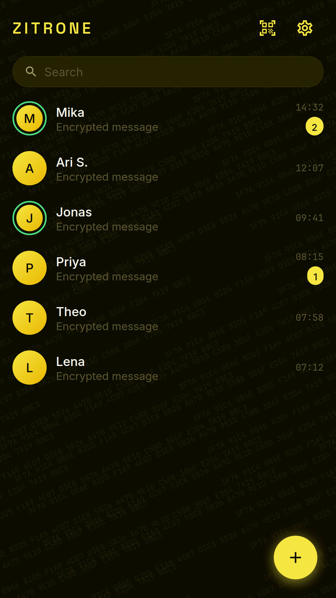
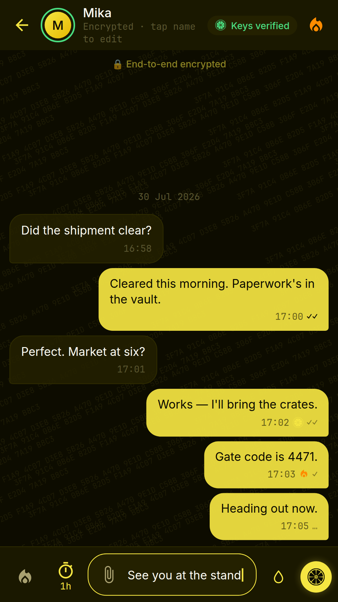
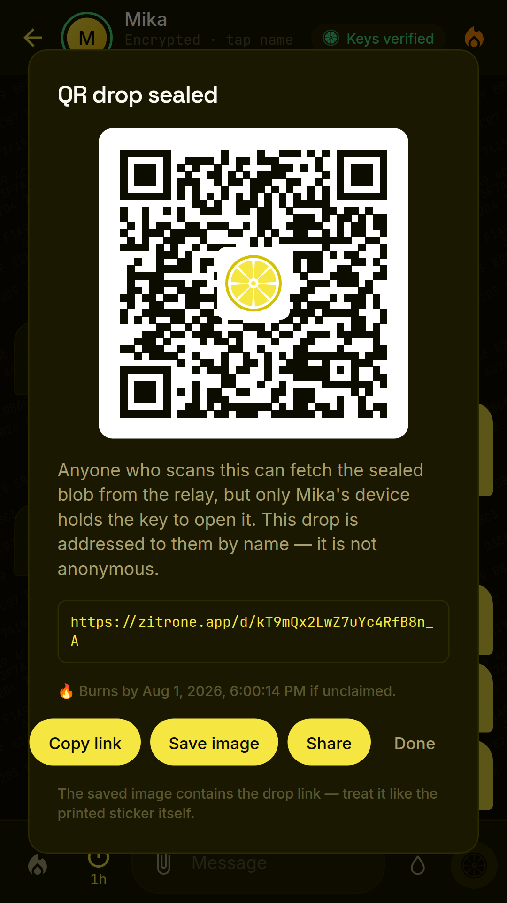
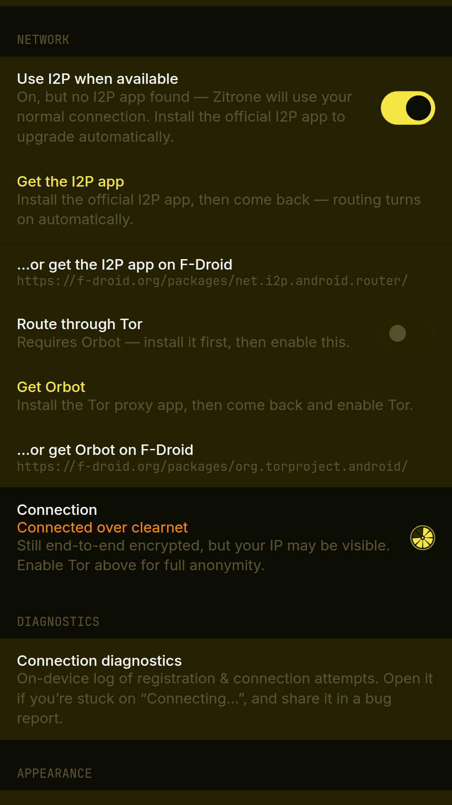

# Zitrone

**Privacy with ZEST — Nothing lasts. That's the point.**

[-F5E642.svg)](#platforms)

> [!IMPORTANT]
> **. See [docs/DEPLOYMENT.md](docs/DEPLOYMENT.md) before touching production.**

## What is Zitrone?

Zitrone is end-to-end encrypted ephemeral messaging. **Android is the only shipped client**,
distributed as a sideloaded APK via GitHub Releases and a Tor onion mirror — there is no app-store
listing. iOS, Linux desktop, and browser clients exist in the repo but trail behind and are **not
distributed** (see [Platforms](#platforms)). Every message is encrypted on your device with the
Signal Protocol (X3DH + Double Ratchet) before it goes anywhere, and the server deletes each
message the instant it's delivered. Messages can burn on read or self-destruct on a timer — from
30 seconds to a week — enforced on both sides of the conversation.

We built it zero-knowledge from the ground up: the server stores public keys and opaque encrypted
envelopes, nothing else. No phone number, no email, no name — your identity is a key pair generated
on your device, and contacts connect by QR code or link. Screenshots and screen recording are
blocked outright on Android, and every chat carries an **identity watermark** — a faint,
deliberately visible lattice of the viewer's own key fingerprint, rendered locally and reported to
no one. There is no telemetry; the watermark is a deterrent, not a tracker.

## Security model

- **Zero-knowledge server** — plaintext never leaves your device; the server can't read messages even if compromised
- **Signal Protocol** — X3DH key agreement + Double Ratchet with per-message keys and forward secrecy
- **Store-and-forward only** — messages purged from the server immediately on delivery acknowledgement
- **No metadata hoarding** — no IP logging, no contact lists, no device identifiers stored
- **Argon2id** key derivation for all passphrases; hardware-backed key storage on mobile
- **TLS 1.3 + certificate pinning** — the shipped Android client pins the relay's leaf public-key
  (SPKI) hash and fails closed on a mismatch, so a mis-issued or MITM certificate is rejected even
  if it chains to a trusted CA

Full details in [docs/SECURITY_MODEL.md](docs/SECURITY_MODEL.md).

## Features

- 🔐 End-to-end encryption via the Signal Protocol
- 🔥 Burn-on-read — destroyed everywhere after first open
- ⏱️ Disappearing messages with configurable TTL
- 📵 Screenshot protection — screenshots and screen recording hard-blocked on Android
  (`FLAG_SECURE`, never conditional)
- 🫥 Identity watermarking — a faint, **deliberately visible** watermark of the viewer's own key
  fingerprint behind every chat; rendered locally, reports nothing to anyone *(renamed 2026-07-30:
  previously listed as "invisible watermarking for leak attribution" — there is no telemetry and
  nothing is attributed to anyone)*
- 🪪 No phone number, email, or name required
- 🔑 Passphrase vault — keys and messages sealed under an unrecoverable passphrase, with a
  plausible-deniability **second vault** (the capability is public; only per-device presence is
  secret — see [docs/VAULT_ARCHITECTURE.md](docs/VAULT_ARCHITECTURE.md))
- 🧨 Pucker Burn — a duress password that wipes everything Zitrone holds on the device
- 🍋 Lemon drops — one-time QR dead drops that burn if unclaimed by a deadline; opening consumes
  them (off by default, enabled in Settings)
- 🌫️ Cover traffic — always on, no toggle; real sends are never delayed to produce cover
- 🕸️ I2P routing by default when the I2P app is installed; optional Tor via Orbot; an honest
  clearnet warning when neither is available
- 📌 TLS 1.3 with certificate pinning in the shipped Android client — fail-closed against MITM

### v1.5 — the security lemon

Five layered defenses, each built as if the one beneath it has already failed:

- 🤷‍♂️ **Plausible deniability** — two (up to three) separate vaults behind different passphrases,
  with no cryptographic evidence a second exists and a fixed no-early-exit unlock-attempt work budget (a **per-device** feature, safe
  because there is no cross-device account access). Status: the crypto primitive is built
  (web/desktop + Android); the **Android everyday vault runtime shipped in 0.9.1-beta**; and as of
  **0.9.2-beta, creating a second (decoy) vault is live** — there is no setup wizard (that would be
  the tell), just the **triple-entry** ceremony at the ordinary lock screen (enter the same
  never-before-used passphrase three times in a row). Plausible deniability is now a **usable**
  guarantee on Android, within documented limits (creation blind-overwrites a random pool slot;
  biometric binds to one vault at a time, first-enable-wins; a chosen wrong passphrase entered three
  times creates an empty vault). The **Pucker Burn duress password shipped in 0.9.3-beta**
  (Settings → Account) — entering it at the lock screen wipes everything Zitrone holds on the
  device. Not yet shipped: per-vault destruction (whole-image account delete only). See
  [docs/VAULT_ARCHITECTURE.md](docs/VAULT_ARCHITECTURE.md) and
  [docs/SECURITY_MODEL.md](docs/SECURITY_MODEL.md)
- 🕵‍♂️💼 **Dead-drop messaging** — **shipped as lemon drops** on Android: seal a message into a
  one-time QR drop that burns if unclaimed by the sender's deadline; opening consumes it. Off by
  default — the compose button is enabled via Settings → Privacy
- 🌫️ **Decoy traffic** — **shipped in 0.10.0-beta.** The client emits synthetic cover traffic so a
  real send is not distinguishable by timing to a **passive network observer** — this is **not** a
  defense against the relay operator, who sees sender and recipient on every message. Deliberately
  no UI and no toggle. A real send is never delayed or reordered to produce cover. See
  [docs/SECURITY_MODEL.md](docs/SECURITY_MODEL.md)
- 🧅 **Multi-hop relay** — 3-hop onion routing; no single relay knows both ends. **Design and code
  exist, but no client routes messages through it yet** — messages go direct to the relay today.
  *(Corrected 2026-07-27: previously stated without qualification.)*
- 🤿 **I2P-first** — I2P is the primary transport and **is working**; Tor is the fallback and
  performs well (fast to boot, latency negligibly above clearnet); clearnet only as a flagged last
  resort. I2P tunnels take time to build on first connect — that is normal, not a failure.
  *(Corrected 2026-07-28: this line previously said I2P was "still in development" with Tor as "the
  active fallback today". Both transports work. The old wording understated a shipped privacy
  feature — see the note in `docs/SECURITY_MODEL.md`.)*
- 👻 ~~Standard / Stealth / Ghost connection modes~~ — **not shipped.** *(Corrected 2026-07-30:
  the mode definitions exist in the repo but are wired to no UI; a user on the shipped client
  cannot select a connection mode. Transport is chosen by the Settings → Network toggles above.)*
- 🍋 **Reveal-and-burn images** — a received image stays covered until tapped; tapping reveals it
  and arms a hard burn timer. *(Corrected 2026-07-30: previously listed as a general "privacy
  view" blur — that per-conversation blur is not wired into the shipped client; the covered-image
  flow is what ships.)*

See [docs/SECURITY_MODEL.md](docs/SECURITY_MODEL.md) for the full onion diagram.

## Screenshots

Zitrone blocks screen capture in-app (`FLAG_SECURE`, unconditional), so real screenshots are
impossible by design. The images below are **reconstructed from the UI source with fake sample
data** — no real conversations, contacts, or identities appear in them.

| Chat list | Conversation | Lemon drop | Network settings |
| --- | --- | --- | --- |
|  |  |  |  |

## Platforms

**Android is the only shipped client**, distributed as a signed, sideloaded APK via
[GitHub Releases](https://github.com/jackofall1232/zitrone/releases) and the Tor onion mirror —
there is no Play Store or other app-store listing. The other clients below exist in the repo,
trail the Android client, and are **not distributed**.

Platform priority and maturity run **Android → Linux desktop → Web → iOS**. The
clients split into two crypto families that **cannot exchange ordinary messages
across the split** — an Android/iOS identity and a web/desktop identity cannot
complete an X3DH handshake at all, in either direction. See
[Platform status and interoperability](docs/SECURITY_MODEL.md#platform-status-and-interoperability)
for the full matrix.

## Release maturity and the `-beta` version labels

**Every release so far has been a complete, working build that could have been published as a beta
at any time.** No release shipped with a known defect, and each passed its own review gates — the
security-sensitive ones through independent paired-blind adversarial review to clean convergence.
The quality bar has been release-grade throughout.

**What the `-beta` label was hedging is the FEATURE LIST, not the quality.** The plausible-deniability
vault is uncharted work with no reference implementation anywhere to borrow from, so how long it
would take to finish the intended feature set was genuinely unknowable. Labelling releases `-beta`
from the start meant the project could **flip to a declared beta at any moment** if a deadline made
that necessary, without having to relabel anything or pretend a decision had been planned. The label
bought optionality against schedule risk. It was never a claim that the feature set was finished.

**In the project's own terms, these are alpha builds**, and are treated as such internally — with
one honest qualification that matters more than the label: **the on-disk vault format is not yet
stable, and a future release may require a fresh install that erases every vault on the device.**
There is no migration and no export. That limitation, not the version string, is the reason these
builds are not yet recommended for data you cannot afford to lose. It is documented in full in
[`docs/design/DECOY_TRAFFIC_0.10.0_SPEC.md`](docs/design/DECOY_TRAFFIC_0.10.0_SPEC.md) §4.1, and it
is the condition that has to clear before a genuine beta.

**The plan from here:** `0.10.0` adds decoy traffic; `0.11.0` is the polish round — the most detailed
UI/UX pass the project has had — and is the **final alpha**. At that point the label flips to a
**true beta**: a V1 stable candidate, distributable for real testing. Android is the security
reference client and carries that release; Linux and iOS are deliberately deferred until after V1
Android testing.

| Platform                   | Stack                                | Crypto family          | Status                                                                                              | Path                           |
| -------------------------- | ------------------------------------ | ---------------------- | --------------------------------------------------------------------------------------------------- | ------------------------------ |
| Android 8+                 | Jetpack Compose + libsignal-client   | libsignal (Curve25519) | **Reference client — the only shipped client.** Signed beta APK, sideloaded (GitHub Releases + Tor onion mirror) | [`apps/android`](apps/android) |
| iOS 16+                    | SwiftUI + libsignal-client           | libsignal (Curve25519) | **In repo, not shipped or distributed.** Interoperates with Android for ordinary messaging; trails on features (e.g. cannot yet receive lemon drops) | [`apps/ios`](apps/ios)         |
| Linux (Debian/Ubuntu/Kali) | Tauri v2 shell; **frontend is `apps/web`** | libsodium / web (Ed25519) | **In repo, not shipped or distributed** — no packages are published. Runs the web crypto stack; interoperates with web, **not** with Android/iOS | [`apps/desktop`](apps/desktop) |
| Browser                    | React 18 + Vite (`apps/web`)         | libsodium / web (Ed25519) | **Not deployed** — unfinished scaffolding; no live instance, registration, or contact flow; deprioritized indefinitely | [`apps/web`](apps/web)         |
| Server                     | Go 1.25+ · Fiber · PostgreSQL 16     | —                      | Relay only                                                                                          | [`server`](server)             |

**Single-device by design.** Each install is an independent identity — **no
account sync, no device linking, no cross-device access**. This is permanent, not
a limitation; moving to a new device means a new identity. See the
[security model](docs/SECURITY_MODEL.md#single-device-by-design-permanent).

## Getting started

See [docs/SETUP.md](docs/SETUP.md) for prerequisites, environment variables, and running the
server, web app, and mobile apps locally.

## Self-hosting

Zitrone is designed to be self-hosted on a small VPS with Docker Compose, including an
optional Tor hidden service. See [docs/SELF_HOSTING.md](docs/SELF_HOSTING.md).

The Tor overlay also serves a static no-JS download mirror at the root of the `.onion`. Two
operational notes:

- **Hybrid by design.** Clearnet API and the Tor hidden service coexist. The static mirror is
  Host-gated — it is served only to requests whose `Host` is your `ONION_ADDRESS`, so clearnet
  visitors and scanners get the API only, never the mirror. Set `ONION_ADDRESS` or the mirror
  fails closed.
- **Stage the APK yourself.** Release artifacts (`*.apk`, `*.aab`, keystores) are **not committed**
  to this repo. Drop the released APK into `onion-site/` and run
  `sha256sum onion-site/*.apk > onion-site/SHA256SUMS` before enabling the mirror. If no APK is
  staged, the page hides the download link and shows staging guidance instead of a dead 404. See
  the [self-hosting guide](docs/SELF_HOSTING.md#stage-the-apk-before-enabling-the-mirror).

## Contributing

Contributions are welcome — read [CONTRIBUTING.md](CONTRIBUTING.md) first. All contributions must
preserve the zero-knowledge architecture.

## Security disclosure

Found a vulnerability? **Do not open a public issue.** Follow the responsible disclosure process in
[SECURITY.md](SECURITY.md).

## License

[AGPL-3.0](LICENSE) — anyone running a modified Zitrone as a service must open source their
changes.
